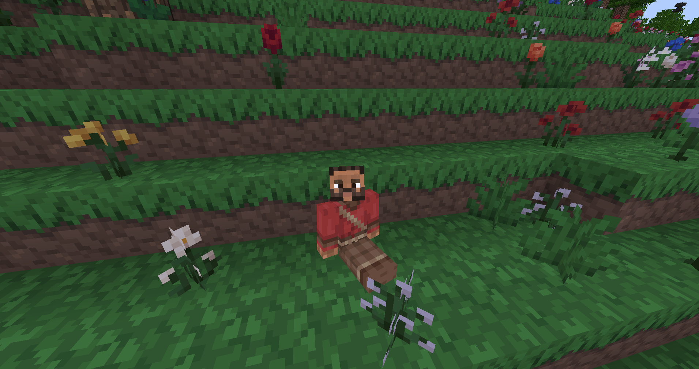

# VoxeLibre /sit and /lay

Adds commands to /lay or /sit to VoxeLibre (ex. MineClone2) or Mineclonia. Port of good old [cozy mod](https://forum.minetest.net/viewtopic.php?f=11&t=14143) (originally made for MTG by everamzah) to work with VL properly and even provide some nice new features!

